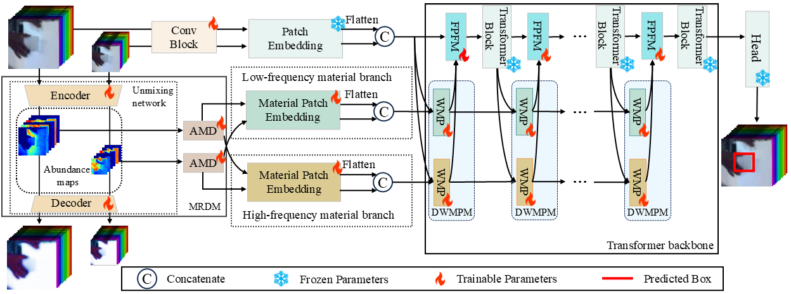

# End-to-End Unmixing with Wavelet-Enhanced Material Prompts for Hyperspectral Object Tracking

**E2E-MPT: End-to-End Unmixing with Wavelet-Enhanced Material Prompts for Hyperspectral Object Tracking**

<p align="center">
  
</p>

## Abstract

Hyperspectral imagery encodes rich material properties that can enhance tracking robustness under appearance ambiguity, illumination change, and background clutter. However, due to the scarcity of hyperspectral video data, existing methods adapt pretrained RGB trackers through spatial or channel fusion while largely overlooking the material information intrinsic to hyperspectral imagery, and the few material-aware approaches rely on external unmixing pipelines decoupled from the tracking objective. Therefore, we formulate hyperspectral object tracking as a joint problem of material decomposition and target localization, coupling the two via a weighted target-oriented unmixing loss that explicitly aligns material representations with localization accuracy. Specifically, we propose a Material Representation Decomposition Module for deep learning-based spectral unmixing with adaptive frequency decomposition, and a Dual-Branch Wavelet-enhanced Material Prompt Module that fuses low- and high-frequency material components with backbone features through efficient spatial-material interaction in the frequency domain, where material textures exhibit compact and scale-separable structure. The framework is model-agnostic and generalizes across different unmixing backbones. Extensive experiments on standard hyperspectral tracking benchmarks demonstrate state-of-the-art performance, validating the effectiveness of end-to-end material-aware tracking.

## Results

<p align="center">
  
</p>

## Environment Setting

The environment setting generally follows [DaSSP-Net](https://github.com/hscv/DaSSP-Net). Please refer to its installation instructions to prepare the basic environment.

A typical setup is as follows:

```bash
conda create -n e2empt python=3.8
conda activate e2empt
pip install -r requirements.txt
```

Please adjust the CUDA, PyTorch, and other package versions according to your local hardware and system configuration.

## Datasets

The HOT2023, HOT2020, and HOT2024 datasets are available from the official hyperspectral object tracking benchmark website:

[https://www.hsitracking.com/](https://www.hsitracking.com/)

Please specify the dataset path in lib\train\admin\local.py and lib\test\evaluation\local.py

## Training

To train E2E-MPT, run:

```bash
python lib/train/run_training.py --script e2empt --config e2empt_deep_all --save_dir ./output --config_prv "baseline"
```

Please modify the configuration file and dataset paths according to your local environment.

## Testing

To evaluate E2E-MPT, run:

```bash
python tracking/test.py --dataset_name HOT20TEST --yaml_name e2empt_deep_all --TEST_DATA_PATH YOUR_TEST_DATA_PATH  --model_path MODEL_WEIGHT
```

After testing, the tracking results will be saved in the corresponding result directory.

## Acknowledgement

This project follows the environment setting of [DaSSP-Net](https://github.com/hscv/DaSSP-Net). We sincerely thank the authors for releasing their excellent work.

We also thank the maintainers of the HOT2020, HOT2023, and HOT2024 hyperspectral object tracking benchmarks for providing the datasets.

## Citation

If you find this work useful for your research, please consider citing our paper.


## Contact

For questions or discussions, please contact:

**Han Xu**
Email: [xu.han2@griffithuni.edu.au](mailto:xu.han2@griffithuni.edu.au)
